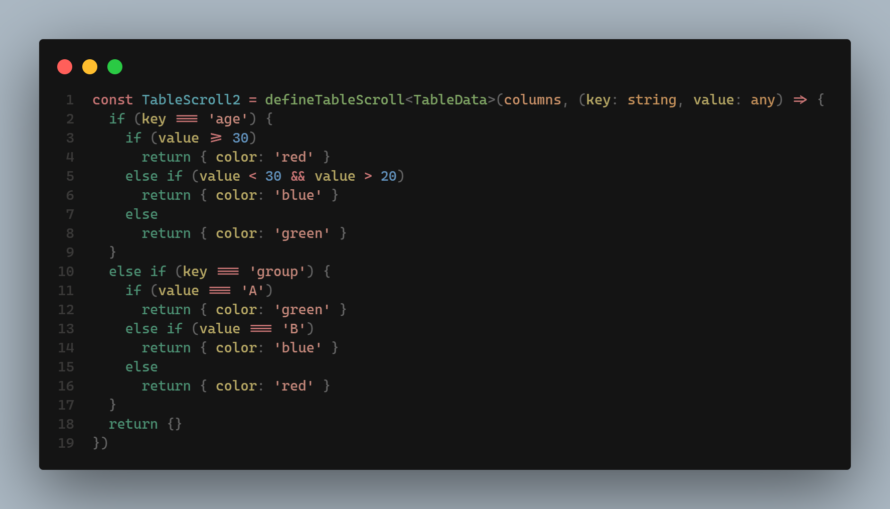

# SeamlessScroll


> The component is a scrollable container that can be used to scroll through a list of items.


Demo: https://vuescroll-container.netlify.app/

# SeamlessScroll


| **属性名** | **描述** | **默认值** |  **类型** |
|:---|:---|:---|:---|
|  to  |  滚动方向  | top  |  'top'\|'bottom'\|'left'\|'right' |
|  dishover  | 是否启用悬停（鼠标悬停停止滚动） | true  |  Number |
|  width  |  可视区宽度  |  auto  |  Number |
|  height  |  可视区高度  |  auto  |  Number |
|  enable  |  启动滚动  |  true  |  boolean |

| **方法** | **描述** | **默认值** |  **类型** |
|:---|:---|:---|:---|
|  updateData  |  更新数据  | 无  |  (fn: () => void ) => void |

# 快速使用

> 暂时不支持npm， yarn安装
```html
<script setup lang="ts">
import { SeamlessScroll } from '~/composables/scroll-core'

</script>

<template>
  <SeamlessScroll>
  <!-- 图片显示以列的形式展示 -->
    <ImageList :length="3" dir="column" /> 
  </SeamlessScroll>
</template>
```

**ImageList.vue**
```html

<script setup lang="ts">
const props = withDefaults(defineProps<{
  length: number
  dir: 'row' | 'column'
}>(), {
  length: 3,
  dir: 'column',
})

</script>

<template>
  <div
    :style="{
      display: 'flex',
      flexDirection: props.dir,
    }"
  >
    <div
      v-for="i in props.length"
      :key="i"
      :style="{
        // 注意事项，横向滚动和纵向滚动会造成item的外边距不受控制，因此，横向滚动设置左右外边距，纵向滚动设置上下外边距
        marginTop: props.dir === 'row' ? '0px' : '5px',
        marginBottom: props.dir === 'row' ? '0px' : '5px',
        marginLeft: props.dir === 'row' ? '5px' : '0px',
        marginRight: props.dir === 'row' ? '5px' : '0px',
      }"
      rounded="10px"
      h50
      w100
      bg-gray-200
      font-mono
      font-size="1.5rem"
      text-blue
      hover="cursor-pointer"
    >
      
    </div>
  </div>
</template>
```

# MessageScroll

| **属性名** | **描述** | **默认值** |  **类型** |
|:---|:---|:---|:---|
|  messages  |  展示的消息  | [] (必填项)  |  Array<string> |
|  messageFormat  |  单条信息格式化  |  (message: string) => message`, |  Function<(string) => string >   |

> 注：这是由SeamlessScroll封装的组件，支持SeamlessScroll的所有属性


```html 
<script setup lang="ts">
import { MessageScroll

} from '~/composables/scroll-core'

</script>

<template>
  <MessageScroll
    :messages="['xxxx', 'yyyy', 'zzzz']"
    :message-format="message => `${message}... &nbsp;&nbsp;`"
    to="left"
  />
</template>
```
# TableScroll

| **属性名** | **描述** | **默认值** |  **类型** |
|:---|:---|:---|:---|
|  data  |  展示的数据  | [] (必填项)  |  Array<T> |

> 注：这是由SeamlessScroll封装的组件，支持SeamlessScroll的所有属性


> 快速开始
```html
<script setup lang="ts">
import type { RowData } from '~/composables/scroll-core'
import { defineColumns, defineTableScroll } from '~/composables/scroll-core'

// 定义表头
const columns = defineColumns([
  {
    title: 'Name', // 显示的标题
    key: 'name',  // 显示的key
    width: '100px', // 列宽
    // style?: {} // 列的公共样式
  },
  {
    title: 'Age',
    key: 'age',
    width: '60px',
  },
  {
    title: 'Group',
    key: 'group',
    width: '60px',
  },
] as const)
// 获取表格数据类型
type TableData = RowData<typeof columns>
// 初始化表格数据
const dataArray: TableData[] = [
  {
    name: 'John Brown',
    age: 18,
    group: 'A',
  },
  {
    name: 'Jim Green',
    age: 25,
    group: 'B',
  },
  {
    name: 'Joe Black',
    age: 30,
    group: 'C',
  },
  {
    name: 'Jim Red',
    age: 28,
    group: 'D',
  },
]

// 定义表格组件
const TableScroll = defineTableScroll<TableData>(columns)

// 表格单行点击事件
const clickItemHandler = function(data: TableData) {
  alert(`点击： ${data.name}`)
}

</script>
<template>
  <div flex="~ row" justify="center">
    <TableScroll :data="dataArray" @clickItem="clickItemHandler" />
  </div>
</template>

<style>
  /* 内置class名 表头 */
.table-scroll {
  width:400px;
}
/* 头部 */
.table-scroll-header {
  background-color: #1010b820;
  padding: 10px;
}
/* 数据部分 */
.table-scroll-body {
  background-color: #00000040;
  width:400px !important;
  padding: 10px 0px;
}

/* 单行样式 */
.table-scroll-row {
  padding: 5px;
}

/* 当行悬浮样式 */
.table-scroll-row:hover{
  background-color: #0000ff20;
}
</style>

```

> defineTableScroll 定义表格组件
```ts
function defineTableScroll<T>(
  columns: readonly Column[], // 表格
  formatStyle?: (key: string, value: any) => any, // 格式化某个数据项的样式
  tableClass = 'table-scroll', // 可自定义的表格样式
  headerClass = 'table-scroll-header', // 可自定义的表头样式
  bodyClass = 'table-scroll-body', // 可自定义内容样式
  bodyRowClass = 'table-scroll-row') // 可自定义的单行样式
```

> 针对数据样式定制




# fix

- 优化使用组件时需要自己绑定id
- 修改组件渲染使用render函数
